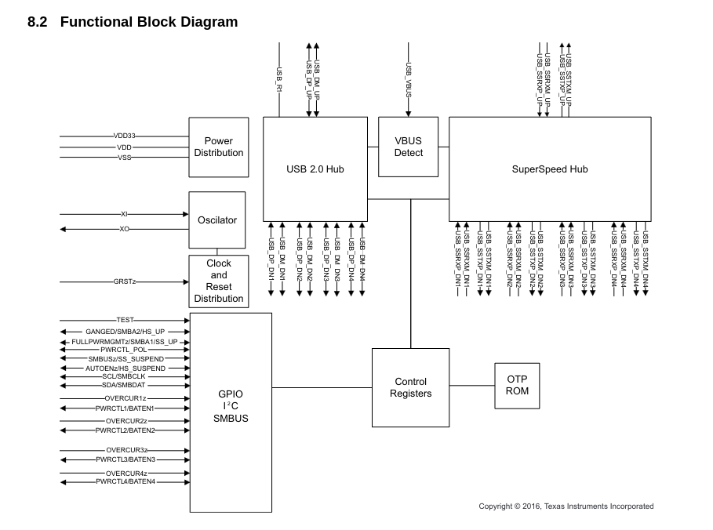

### Hardware Stuffs
- [ ] USB
	- Thunderbolt or standard USB C?
	- [ ] 4x USB 3.0
		- TUSB8041B
		- NOTES:
			- Might be less if daisy chaining
	- [ ] Nx 4x USB 3.0
		- TUSB8041B
		- NOTES:
			- N TUSB8041Bs will be daisy chained to the first 
			- N <= 4
	- [ ] 4x USB 2.0 (prob not)
		- N/A
	- [ ] ~~Power Delivery Per Port (optional)~~
		- N/A
	- [ ] ~~External Power In (with PD support)~~
		- N/A
	- [ ] Host Charging (prob not)
		- Pros
			- Charging :D
		- Cons
			- Complexity increases a shit ton
			- Not a lot of pros
			- Possibility of breaking devices during testing
- [ ] Other
	- [ ] 1x UART/SPI/I2C
		- FT2232H
	- [ ] 1x SD reader
		- N/A
	- [ ] ~~1x HDMI (optional)~~
		- N/A
	- [ ] 1x 3.5mm (optional)
		- N/A (XMOS adapter?)

### Connection method
- [ ] USB (A or C) to USB C 3.2 capable cable to C receptacle
	- Pros
		- Can support HOST USB A or USB C
		- USB C to USB C is becoming a common cable
	- Cons
		- Carry extra cable
		- USB C is complex
		- USB C 3.2 is kinda expensive (certified ones at least)
 - [ ] USB (A or C) to USB B 3.2 capable cable to USB B receptacle
	- Pros
		- Can support HOST USB A or USB C
	- Cons
		- Bulky AF
		- Carry extra cable
		- USB B kinda old ngl
- [ ] USB (A or C) directly to device (non-detachable)
	- Pros
		- No need for extra cable
	- Cons
		- Bulky
		- Can only use either HOST USB A or USB C, not both

### Extra Links
- https://microchip.my.site.com/s/article/How-to-use-a-USB-VID-and-PID-from-the-USB-sub-licensing-program
- https://www.ti.com/product/HD3SS3212
- https://www.ti.com/product/TPD1E05U06
- https://www.ti.com/product/TUSB8041
- https://github.com/DynamixYANG/highendusb3hub
